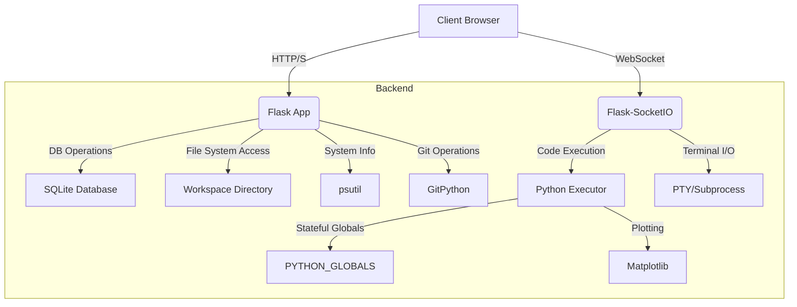

# Nbook Architecture

Nbook is designed as a modern web application, leveraging Flask for the backend, Flask-SocketIO for real-time communication, and a rich JavaScript frontend for an interactive user experience.

## 1. Overall System Design

The architecture follows a client-server model with a strong emphasis on real-time interaction:

*   **Client (Browser):** Renders the user interface, handles user input (code, terminal commands, file operations), and communicates with the server via HTTP (for initial page loads, file uploads/downloads) and WebSockets (for code execution, terminal I/O, system monitoring).
*   **Server (Flask Application):**
    *   Manages application state.
    *   Handles HTTP requests (routing, file serving, API endpoints).
    *   Manages WebSocket connections for real-time features.
    *   Executes Python code in a stateful environment.
    *   Interacts with the file system for workspace management.
    *   Persists notebook data in an SQLite database.
    *   Provides a Command Line Interface (CLI) for server management.

## 2. Core Modules (`core` Directory)

The `core` directory encapsulates the main business logic and application components.

*   **`core/__init__.py`**:
    *   Initializes Flask extensions: `SQLAlchemy` for database interaction and `SocketIO` for WebSocket communication.
    *   Defines the `Notebook` SQLAlchemy model, which represents a saved project in the database.
*   **`core/cli.py`**:
    *   Uses `Click` to define command-line interface commands (`start`, `free`, `convert`).
    *   Acts as the entry point for running the Nbook server in different modes or performing utility tasks.
*   **`core/executor.py`**:
    *   Manages the stateful execution of Python code cells.
    *   Maintains a global `PYTHON_GLOBALS` dictionary to preserve variable state across cell executions.
    *   Handles "magic commands" (e.g., `!ls` for shell execution).
    *   Injects `matplotlib.pyplot` patching to capture and display plots as base64 images in the frontend.
    *   Captures `stdout` to return execution results to the client.
*   **`core/routes.py`**:
    *   Defines Flask `Blueprint` for the main application routes.
    *   **HTTP Endpoints:** Handles requests for rendering templates (`/`, `/history`), file system operations (`/files`, `/files/content`, `/files/new`, `/files/delete`, `/files/rename`), project history management (`/history/save`, `/history/load`, `/history/rename`, `/history/export`, `/history/delete`), system monitoring (`/system/stats`), variable inspection (`/variables`), and Git operations (`/git/clone`).
    *   **SocketIO Event Handlers:** Manages real-time terminal input/output (`terminal_input`, `terminal_output`) and code execution (`execute_code`, `execution_result`).
    *   **Security Middleware:** Implements `check_api_key` to enforce secure mode access.
    *   **Terminal Management:** Uses `pty` (if available) or `subprocess` to create and manage a pseudo-terminal for the integrated terminal.
*   **`core/terminal.py`**:
    *   Contains functions to start the Flask-SocketIO server in `secure` or `free` mode.
    *   Handles the generation and management of the API key in secure mode.
    *   Implements the `convert_notebook` utility to transform Nbook project files into standard code directories.

## 3. Frontend/Backend Interaction

Nbook uses a hybrid approach for client-server communication:

*   **HTTP Requests:** Used for initial page loads, file uploads, and specific API calls that don't require real-time streaming (e.g., saving/loading projects, renaming files).
*   **WebSockets (Flask-SocketIO):** Essential for the interactive features:
    *   **Terminal:** Raw terminal input from the client is sent via `terminal_input` event, and server output is streamed back via `terminal_output`.
    *   **Code Execution:** Code from a cell is sent via `execute_code`, and the execution result (including captured `stdout` and plot images) is returned via `execution_result`.
    *   **System Monitoring:** The client periodically polls `/system/stats` via HTTP, but real-time updates could also be implemented via WebSockets for more efficiency.

## 4. Database Schema

Nbook uses a simple SQLite database managed by Flask-SQLAlchemy.

*   **`Notebook` Model:**
    *   `id` (Integer, Primary Key): Unique identifier for each notebook.
    *   `title` (String): User-defined title for the notebook.
    *   `content` (Text): Stores the JSON representation of the notebook's cells (code, language, etc.).

## 5. Workspace Management

The application maintains a `WORKSPACE_DIR` (defined in `config.py`) where all user files and cloned Git repositories reside.
*   File operations (create, read, update, delete) are performed within this directory, ensuring that users cannot access arbitrary paths outside the designated workspace.
*   Git cloning operations also target this workspace.

## 6. Security Model

Nbook supports two operational modes:

*   **Free Mode:**
    *   No API key required.
    *   Suitable for local development, personal use, or trusted environments.
    *   Started with `python app.py free`.
*   **Secure Mode:**
    *   Generates a unique API key upon startup.
    *   All API requests (including SocketIO connections) must include this key (either as a URL parameter `?key=` or `X-API-KEY` header).
    *   Provides a basic layer of access control.
    *   Started with `python app.py start`.

This architecture provides a robust foundation for an interactive development environment, balancing functionality with ease of use and deployment flexibility.

written by Neorwc